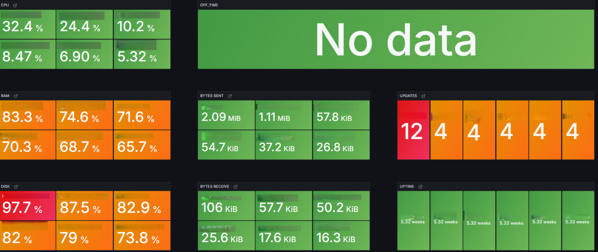
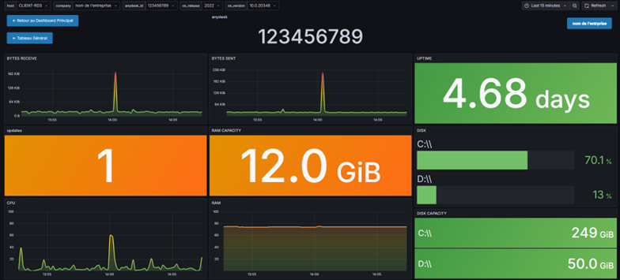

# Agent de Monitoring Système (Windows)

> **Pour les utilisateurs finaux : Voir le [Guide Utilisateur Simplifié](MANUEL_UTILISATEUR.md)**

L'**Agent de Monitoring Modulaire** est une solution complète, sécurisée et légère pour surveiller vos infrastructures Windows. Il collecte des métriques clés et les expédie vers une base de données **InfluxDB** pour visualisation (Grafana, etc.).

---

## Fonctionnalités Clés

*   **Surveillance Complète** : CPU, RAM, Disques (espace/IO), Réseau, Uptime, Processus spécifiques (AnyDesk...), Windows Update.
*   **Sécurité Renforcée** :
    *   Chiffrement AES-128 du fichier de configuration (`config.ini`).
    *   Clé de chiffrement dérivée de l'empreinte matérielle (unique par machine).
    *   Stockage du mot de passe maître dans le Registre Windows avec ACLs strictes.
*   **Mises à Jour Automatiques** : Système basé sur **TUF (The Update Framework)** garantissant intégrité et authenticité des patchs.
*   **Mode Réparation Automatique** : Détection et correction automatique des problèmes de droits (ACLs) au lancement.
*   **Discret & Efficace** : Fonctionne en tâche de fond avec une icône dans le System Tray pour le contrôle rapide.

---

## Visualisation (Tableaux de bord)


*Vue d'ensemble d'un hôte spécifique avec métriques de performance en temps réel.*


*Vue détaillée permettant de surveiller l'état de santé global de l'infrastructure.*

---

## Infrastructure Serveur (Nouveau)

Pour bénéficier des mises à jour automatiques, un serveur dédié est nécessaire :
*   **Web** : Nginx + PHP 8.x
*   **Sécurité** : HTTPS (Certificat auto-signé accepté par l'agent).
*   **Infrastructure** : Le serveur héberge l'interface de gestion (`server_tools/`) et le repository TUF.

*Voir `TECHNICAL_DOCS.md` pour le guide d'installation complet du serveur.*

---

## Installation

### Via l'Installateur (Recommandé)
1.  Téléchargez et exécutez `setup_agent.exe`.
2.  L'installateur configure automatiquement :
    *   L'installation dans `C:\Program Files\MonitoringAgent`.
    *   Le lancement au démarrage système (Tâche planifiée SYSTEM).
    *   L'icône de contrôle à l'ouverture de session (Tâche planifiée User).

### Installation Manuelle (Portable)
1.  Décompressez l'archive dans le dossier de votre choix (ex: `C:\Agent`).
2.  Exécutez `install_agent.iss` (si Inno Setup est installé) ou lancez simplement `agent.exe`.

---

## Configuration & Utilisation

### Premier Lancement
Au premier démarrage, si aucun fichier `config.ini` n'existe, l'**Assistant de Configuration** se lance automatiquement :
1.  Définissez un **Mot de Passe Maître** (ne l'oubliez pas !).
2.  Entrez le nom de la machine et de l'entreprise.
3.  Sélectionnez les disques à surveiller.
4.  L'agent démarre ensuite automatiquement.

### Modifier la Configuration
Deux méthodes pour accéder à l'éditeur sécurisé :
*   **Via l'icône (System Tray)** : Clic-droit sur l'icône "Agent" > **🛠 Modifier le fichier config**.
*   **Via Ligne de Commande** (Admin requis) :
    ```cmd
    agent.exe --configure
    ```

L'éditeur vous permet de modifier les paramètres InfluxDB, l'URL de mise à jour, etc. Les champs sensibles (mots de passe, tokens) sont automatiquement rechiffrés à la sauvegarde.

---

## Commandes Avancées

*   `agent.exe --repair` : Force le mode réparation pour corriger les permissions du Registre (Requiert l'élévation Admin).
*   `agent.exe --configure` : Ouvre directement l'éditeur de configuration.

---

## Compilation & Développement

Pour générer une nouvelle version (requiert Python 3.10+) :

1.  **Prérequis** :
    ```bash
    pip install -r requirements.txt
    ```
2.  **Modifier le code**
    *   Modifier la constante `VERSION` dans le `config_manager.py`

3.  **Compiler et Publier** :
    ```bash
    python release.py publish 1.2.0
    ```
    Cela va :
    *   Compiler `agent.exe` avec PyInstaller.
    *   Générer l'installateur `setup_agent.exe` (si Inno Setup est dans le PATH).
    *   Créer les métadonnées TUF dans `repository/`.

---

---
#### Made by Tristan Carretey
#### https://carretey-tristan.dev
---